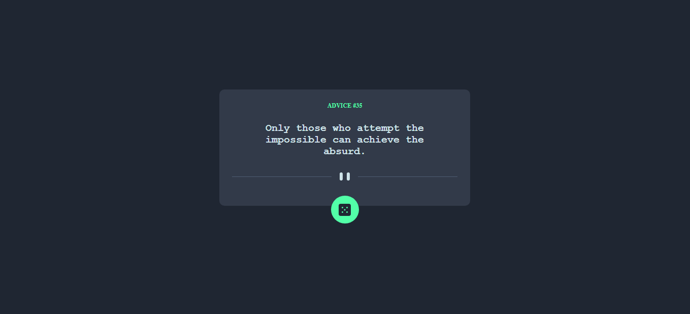
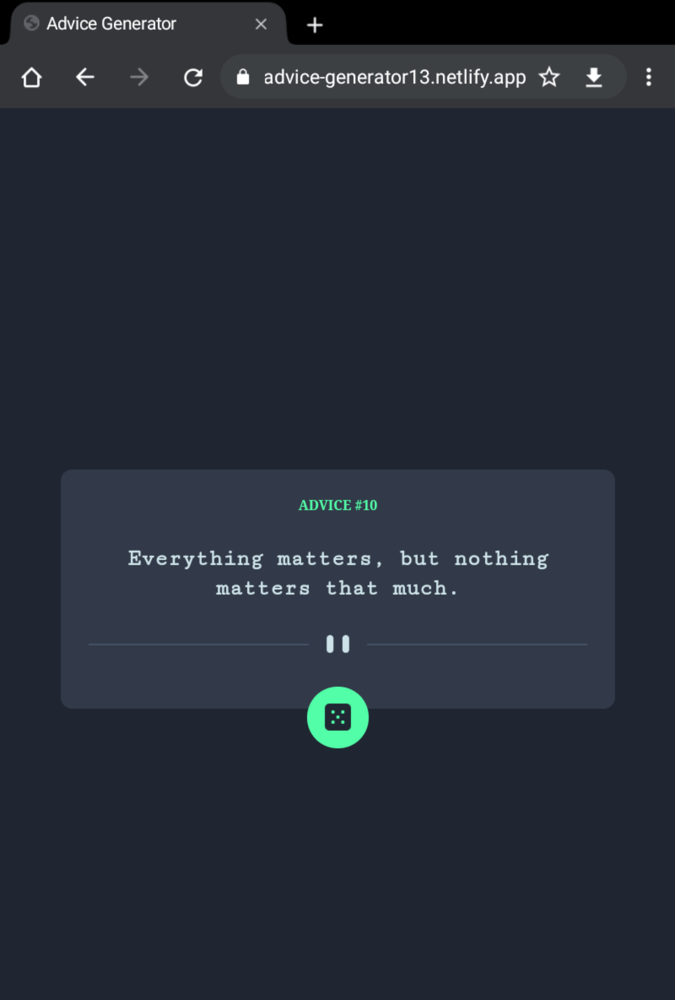

# Frontend Mentor - Advice generator app solution

This is a solution to the [Advice generator app challenge on Frontend Mentor](https://www.frontendmentor.io/challenges/advice-generator-app-QdUG-13db). Frontend Mentor challenges help you improve your coding skills by building realistic projects.

## Table of contents

- [Overview](#overview)
  - [The challenge](#the-challenge)
  - [Screenshot](#screenshot)
  - [Links](#links)
- [My process](#my-process)
  - [Built with](#built-with)
  - [What I learned](#what-i-learned)
  - [Continued development](#continued-development)
  - [Under development](#Under-development)
- [Author](#author)

## Overview

### The challenge

Users should be able to:

- View the optimal layout for the app depending on their device's screen size
- See hover states for all interactive elements on the page
- Generate a new piece of advice by clicking the dice icon

### Screenshot



Tablet screenshot



### Links

- Solution URL: [GitHub](https://github.com/IagoBomfim/Advice-generator-app)
- Live Site URL: [Advice Generator](https://main--advice-generator13.netlify.app/)

## My process

### Built with

-  

- 

- [](https://reactjs.org/) - JS library

- [](https://styled-components.com/) - For styles

### What I learned


Developing learning with API consumption through Http requests, with the axios framework:

```js
import axios from "axios";

export const Api = axios.create({
    baseURL: "https://api.adviceslip.com"
});

```

Improvement of css knowledge with the styled components framework:

```js
import styled, { keyframes } from 'styled-components';

export const Container = styled.div`
     width: 100%;
     height: 100%;

     min-height: 100%;
     min-height: 100vh;

     display: flex;
     flex-direction: column;
     justify-content: center;
     align-items: center;
`;

export const Box = styled.div`
    padding: 25px;
    padding-bottom: 50px;

    border-radius: 10px;

    display: flex;
    flex-direction: column;
    align-items: center;

    background-color: rgb(50, 58, 73);
`;

```

### Continued development

- Css and Styled Components
- Html
- React Js
- API consumption with axios

## Under development

- Advice history
- Native advice sharing
- Login account with profile picture, nickname
- Responsiveness on mobile devices

## Author

- Frontend Mentor - [@IagoBomfim](https://www.frontendmentor.io/profile/IagoBomfim)

- GitHub - [@IagoBomfim](https://github.com/IagoBomfim/)
"# Advice-app" 
